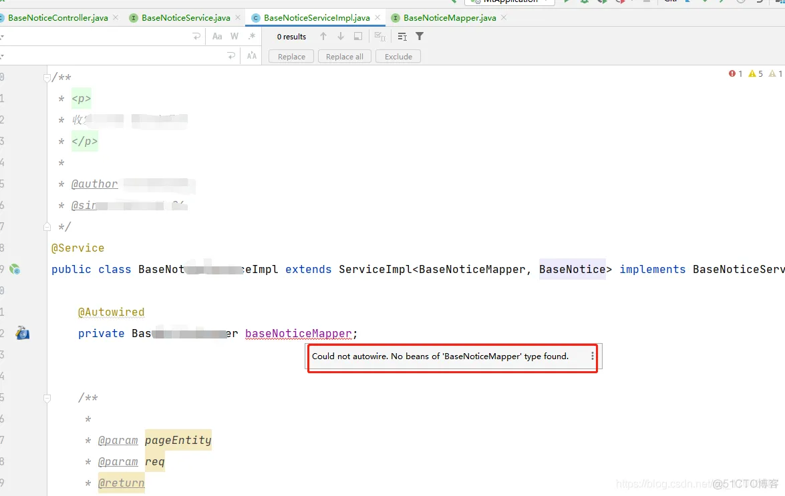

<!--
 * @Author: Dzzzzzzy
 * @Date: 2023-09-08 15:02:08
-->
解决：Could not autowire. No beans of ‘**Dao’ type found.

在用idea写一个实现类时引用了mapper类的来调用dao层的处理，使用@Autowired注解时被标红线，找不到bean。

解决办法：在mapper加@mapper或者@repository注解。

这两种注解的区别在于：

1、使用@mapper后，不需要在spring配置中设置扫描地址，
通过mapper.xml里面的namespace属性对应相关的mapper类，
spring将动态的生成Bean后注入到ServiceImpl中。

2、@repository则需要在Spring中配置扫描包地址，
然后生成dao层的bean，之后被注入到ServiceImpl中